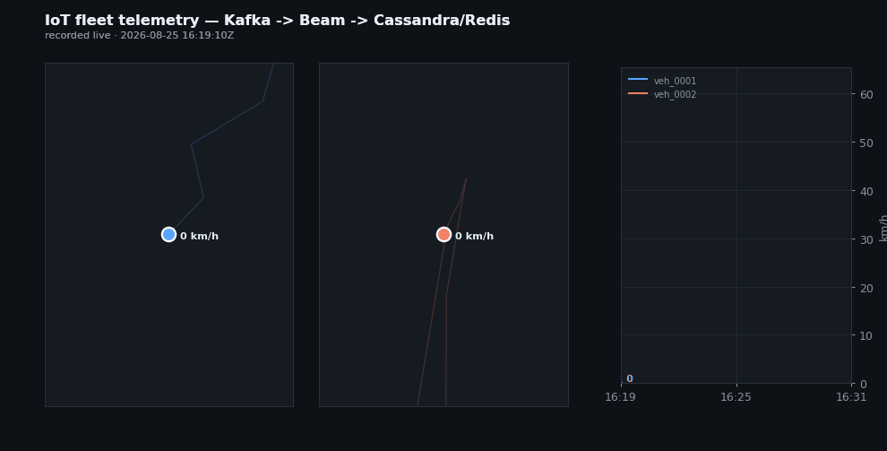
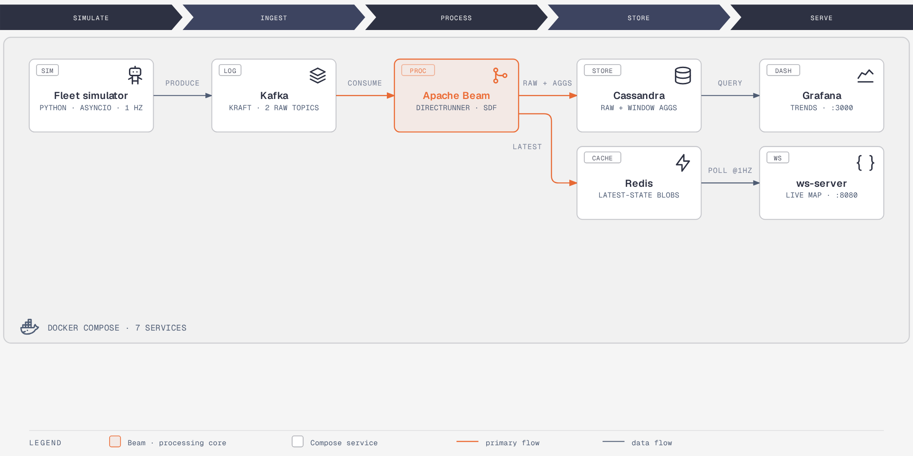
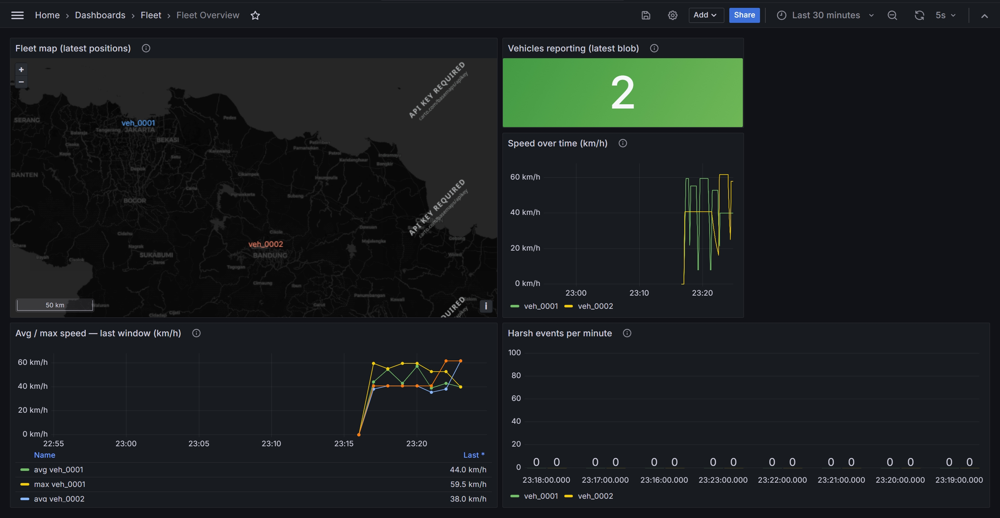
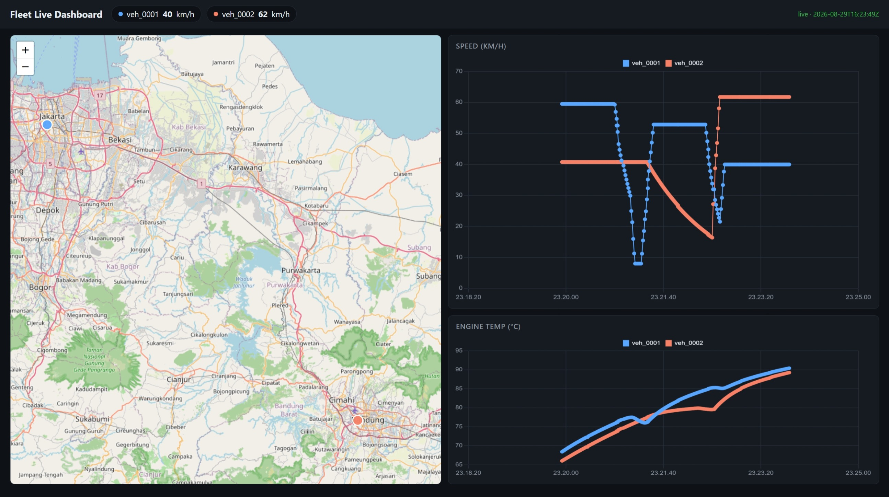

# Realtime Fleet Telemetry

**Live fleet intelligence, end to end.** Two delivery vehicles stream their engine and GPS telemetry through a real streaming stack, and turn it into a live fleet map, per-minute operational KPIs, and driving-safety signals a fleet operator could actually act on.

Everything runs from a single `docker compose up`.



## Why this exists

Fleet businesses run on questions their data can't answer fast enough:

- *Where is every vehicle right now?*
- *Is anyone driving in a way that burns fuel or risks an accident?*
- *Which engines are heading for a costly breakdown?*

The data to answer all of this already exists inside every vehicle's ECU. The hard part is
moving it continuously and real-timey from the moving vehicles to the people
making decisions.

## What an operator gets

| Business question | Answered by |
|---|---|
| Where is the fleet *right now*? | Live map with per-second positions and speeds |
| How is the fleet performing? | 1-minute per-vehicle KPIs + 5-minute rolling fleet view (avg/max speed, harsh events) |
| Is anyone driving dangerously? | Harsh braking / acceleration / cornering, over-speed and idling flagged as they happen |
| Which vehicles need attention? | Engine temperature, fuel level, and fault codes streamed continuously |
| What exactly happened last Tuesday? | Every raw reading kept in queryable history for audits and analysis |

## The system in one picture



The vehicles are simulated; traffic-aware speeds on real routes around Jakarta and Bandung, engine data derived from motion physics, and driver behaviors that
produce realistic events. 

They publish telemetry and driving events to Kafka, where a
streaming pipeline built on Apache Beam processes the feed continuously: raw history lands
in Cassandra, per-minute and rolling-window aggregates power the KPIs, and each vehicle's
latest state is pushed to Redis for instant reads. Two dashboards consume the results —
Grafana for trend analysis, and a custom live dashboard that pushes updates to browsers
over WebSocket the moment something happens.

## Screenshots

<!-- Drop in: docs/screenshot-grafana.jpg -->


<!-- Drop in: docs/screenshot-dashboard.jpg -->


## Run it

```bash
docker compose up --build
```

| URL | What you'll see |
|---|---|
| http://localhost:8080 | Live dashboard — fleet map + rolling charts, updating every second |
| http://localhost:3000 | Grafana (`admin`/`admin`) → "Fleet Overview" |

<details>
<summary>Peek at the raw data flowing through</summary>

```bash
# raw telemetry from Kafka
docker exec iot-kafka /opt/kafka/bin/kafka-console-consumer.sh \
  --bootstrap-server localhost:9092 --topic iot.telemetry.raw

# latest-state blobs in Redis (one per vehicle, overwritten every tick)
docker exec iot-redis redis-cli --scan --pattern 'vehicle:latest:*'

# per-minute KPIs in Cassandra
docker exec iot-cassandra cqlsh cassandra 9042 \
  -e "SELECT vehicle_id, window_start, avg_speed_kmh, harsh_event_count
      FROM fleet_telemetry.vehicle_window_aggregates LIMIT 10;"
```

</details>

## Testing, testing

A streaming system that *looks* alive is not the same as one that *is* alive. This repo ships a 30-assertion end-to-end suite that runs against the live stack and checks what an operator would care about: data is actually flowing (not stale), storage is growing,
dashboards return real query results, browsers receive valid live updates, aggregates
arrive on schedule, trips are detected, and **late-arriving data is
dropped loudly instead of silently corrupting the KPIs**.

```bash
python3 tests/e2e_test.py
```

## Design choices worth knowing

- **Two speeds of truth.** 

  - "Where is the fleet *now*" is served from Redis (sub-millisecond reads); 
  - "What happened" is served from Cassandra (write-optimized history). Each dashboard reads from the store that matches its question.

- **The schema follows the questions.** 
  
  Cassandra tables are modeled one per business question, so every dashboard query is a single fast lookup — no joins, no aggregation at query time.

- **Honest streaming semantics.** 

  Windows flush on schedule with an explicit late-data hold; anything too late is dropped *and logged*, never silently mixed into the KPIs.
  The pipeline's clocks advance from the data's own event time, not the server's.

## What could happen next?

- **Alerting**, engine-temp and harsh-driving thresholds pushed to operators *before*
  they become breakdowns or accidents.
- **Scale-out runner**, swap in Apache Flink to go from demo scale to real fleet volumes
  without changing the pipeline logic.