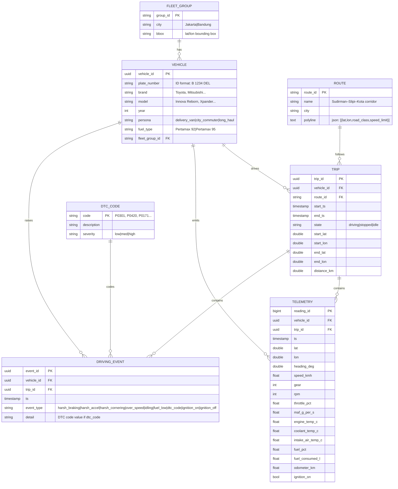

# Fleet Telemetry Streaming Pipeline — Project Spec

## 1. Overview

A portfolio project simulating a small vehicle fleet (2 vehicles) streaming live ECU telemetry — GPS position, OBD-II/engine PIDs, and driving events — through Kafka, processed in real time with Apache Beam, stored in Cassandra/ScyllaDB, and surfaced through two dashboards: Grafana for fast time-series visibility, and a custom WebSocket frontend as the polished centerpiece.

The domain deliberately mirrors real fleet/vehicle telemetry problems (relevant to automotive data engineering work) while staying self-contained enough to build and demo end-to-end. The generator is trip-centric: each vehicle runs discrete trips (ignition on → drive a route → ignition off), with speed, position, and events all derived from the trip profile rather than random walks — so the data looks plausible on a map and on charts.

**Goals**
- Practice event-driven architecture with Kafka as the backbone.
- Learn stream processing concepts (windowing, watermarks, late data) via Apache Beam.
- Learn query-driven NoSQL schema design with Cassandra/ScyllaDB — a different discipline from the relational modeling used day-to-day.
- Build two flavors of real-time dashboard and understand when each is the right tool.
- Run the whole stack locally via Docker Compose, in a state that's demoable and portable.
- Produce realistic, trip-structured ECU telemetry (OBD-II PIDs, not just GPS) that an automotive reviewer would find credible.

**Non-goals (for v1)**
- No real vehicle hardware or GPS integration — synthetic data only.
- No auth/multi-tenancy — single-fleet, single-user demo.
- No production-grade fault tolerance (exactly-once semantics, multi-broker HA) — noted as stretch goals instead.

---

## 2. Architecture

```
IoT Sensor Simulator (Python)
        |
        v
Kafka  --(raw telemetry + events)-->  Apache Beam (windowed aggregation)
                                                        |
                                        +---------------+---------------+
                                        v                               v
                              Cassandra / ScyllaDB              Redis (latest state)
                              (raw history + aggregates)                |
                                        |                               |
                                        +---------------+---------------+
                                                        v
                                   Grafana  <---- query ----  data layer
                                        +
                                   Custom WebSocket dashboard <-- pushed from Beam/Redis
```

Two consumption paths exist deliberately:
- **Grafana** reads from Cassandra/Redis on a poll interval — good for historical trend panels and fast to stand up.
- **Custom WebSocket server** subscribes to a lightweight "fan-out" topic that Beam (or a small consumer) publishes to, pushing updates to the browser the moment they're computed — this is what makes the frontend feel truly live, not polled.

---

## 3. Tech stack

| Component | Tool | Role |
|---|---|---|
| Device simulation | Python (asyncio) | Trip-structured ECU telemetry generator for 2 vehicles; emits GPS + OBD-II PIDs + driving events to Kafka. Toggle via env, fixed-cadence pace, SQLite for trip resumability |
| Ingestion | Kafka (single broker, KRaft mode — no Zookeeper) | Durable, ordered, partitioned event log; decouples producers from processors |
| Stream processing | Apache Beam (DirectRunner, or Flink runner as a stretch goal) | Windowed aggregation, late-data handling, fan-out to storage and dashboard |
| Storage (history + aggregates) | Cassandra or ScyllaDB | High-throughput, partition-key-first storage for timestamped telemetry and rollups |
| Storage (latest state) | Redis | Sub-millisecond reads for "where is the fleet right now" |
| Dashboard A | Grafana | Time-series panels, map panel for GPS, alerting |
| Dashboard B | Custom HTML/JS + WebSocket server | Live-updating map and charts, full control over UX |
| Orchestration/runtime | Docker Compose | Single-command local stack: Kafka, Beam job, Cassandra, Redis, Grafana, WebSocket server, simulator |

### 3.1 Data generator service — design

The simulator is a first-class Docker Compose service (`simulator`) running Python asyncio. It is the only producer in the system; everything downstream consumes from Kafka. The focus is **trip realism**, not volume: only 2 vehicles, but each one drives believable trips with physically plausible position, speed, and event sequences.

**Vehicles.** Two fixed vehicles, hand-defined rather than random, so their behaviour is reviewable:

| vehicle_id | Plate | Brand/Model | Persona | Home city |
|---|---|---|---|---|
| `veh_0001` | `B 1234 DEL` | Toyota Innova Reborn | `delivery_van` | Jakarta |
| `veh_0002` | `D 5678 AZR` | Mitsubishi Xpander | `city_commuter` | Bandung |

Each vehicle is an asyncio task emitting on a fixed tick (default 1 Hz telemetry; GPS is part of the same tick). Two tasks → ~2 msg/s constant, trivially paced and CPU-independent. Cadence is driven by a single scheduler tick that fans out to all vehicle tasks, so adding vehicles later keeps pace without per-task `time.sleep()` drift.

**Trip lifecycle.** A vehicle is always in one of: `idle` (engine off, parked), `driving` (engine on, moving), `stopped` (engine on, stationary in traffic). A trip is `ignition_on` … `ignition_off`:

```
idle ──ignition_on──▶ driving ⇄ stopped ──ignition_off──▶ idle
```

Trip start/end are emitted as events on `iot.events.raw` (so session windows in Beam have explicit boundaries). After each trip the vehicle rests for a deterministic-but-jittered dwell, then starts the next trip from its current position. This produces indefinite, non-stop "transactions" at a consistent pace without ever teleporting the vehicle.

**Route = polyline of waypoints.** Each trip selects a route from a small catalog of real Indonesian corridors, encoded as a polyline of (lat, lon, road_class, speed_limit) nodes — e.g.:

- Jakarta: Senayan → Slipi → Kota → Kelapa Gading (Jl. Sudirman + Jl. Gatot Subroto corridor)
- Bandung: Cihampelas → Dago → Pasteur → Cileunyi (Jl. Asia Afrika + Jl. Pasteur corridor)
- Inter-city: Jakarta → Cikarang → Cirebon via Tol Jakarta–Cikampek (used for `delivery_van` inter-city trips)

Routing is pre-computed at trip start: the simulator builds a reach-by-reach plan of segment distances, target speeds (per `road_class`: `toll=100`, `arterial=60`, `local=40`, `residential=20`), and traffic-factor modifiers by time-of-day (Jakarta rush hours 07–09 / 17–19 reduce target speed by 0.4×). The GPS position advances along the great-circle interpolation between consecutive waypoints, distance scaled by current speed per tick — so the marker moves smoothly on a map and the speed/position relationship is always physical.

**Speed and motion model.** Speed is *derived*, not random:

1. Look up the current segment's target speed (`road_class` limit × traffic factor).
2. Apply a target-speed profile that ramps up on segment entry, holds, then decelerates approaching the next node (anticipating intersections/turns).
3. Solve a simple kinematic update each tick: `v_next = clamp(v + a_max * Δt, 0, v_target)` where `a_max` depends on persona (`delivery_van` gentler accel/brake than `city_commuter`).
4. Add ±10% jitter so traces look human, not soldier-step.
5. Occasionally inject traffic-light stops (decel to 0, dwell 20–60 s, accel again) and one or two congestion pockets per trip.

This guarantees the speed graph looks like real driving — accelerate, hold, decelerate, stop — instead of a noise band.

**ECU PIDs are derived from motion.** All engine fields are computed from the speed/gear/rpm relationship, never sampled independently:

- `gear` = f(speed): 1<20, 2<40, 3<60, 4<80, 5 otherwise (km/h bands).
- `rpm` = f(speed, gear): `idle ~800`, then `rpm = idle + (speed / gear_ratio_map[gear]) * scale`, clamped 800–6500, with smooth lag (first-order filter) so it doesn't snap.
- `throttle_pct` = rough inverse of `v_target − v` plus accel demand, 0–100%.
- `maf_g_per_s` ≈ `rpm * throttle_pct * k` (engine displacement factor).
- `engine_temp_c` / `coolant_temp_c`: warm-up curve from ambient (~29°C, tropics) → 88–95°C steady-state over ~5 min since ignition; rises further under sustained high rpm.
- `intake_air_temp_c` ≈ ambient + small rise (29–38°C, tropical).
- `fuel_pct`: monotonic decrease, rate ∝ `maf_g_per_s` (litres/hour), refuel only between trips when parked.
- `fuel_consumed_l` and `odometer_km`: monotonically increasing per vehicle lifetime, persisted across restarts via SQLite.
- `ignition_on`: boolean, transitions emit trip start/end events.

**Driving events are threshold crossings, not random draws.** Emitted to `iot.events.raw` only when the physics crosses a rule:

| event_type | Trigger |
|---|---|
| `harsh_braking` | decel < −2.5 m/s² |
| `harsh_accel` | accel > +2.5 m/s² |
| `harsh_cornering` | speed > 40 km/h and heading Δ between ticks > 25° |
| `over_speed` | speed > segment speed_limit + 10 km/h sustained ≥ 3 s |
| `idling` | engine_on, speed == 0, duration > 120 s |
| `fuel_low` | fuel_pct crosses below 10% |
| `dtc_code` | rare (~1% of trips), seeded from DTC catalog with realistic code/detail |
| `ignition_on` / `ignition_off` | trip lifecycle boundary |

This is what makes the data "random-but-structured": the random parts are traffic-light timing, congestion onset, route selection, dwell length — but the consequences (events, speed curve, fuel burn) fall out of physics, not a die roll.

**State persistence (SQLite).** A single `simulator_state.db` file (mounted as a Docker volume) stores per-vehicle: last lat/lon, odometer_km, fuel_pct, fuel_consumed_l, current trip_id, ignition state, last_updated. On restart the simulator reads this and continues where it left off — vehicles do not teleport back to origin. This is **producer-local resumability only**, not a staging store on the path to Kafka. Kafka is still the durable log; writes to Kafka happen directly on every tick.

**On/off toggle.** Controlled by env, not a kill signal:

- `SIM_ENABLED=0` → container starts, logs "simulator disabled", sleeps forever (keeps compose healthy).
- `SIM_ENABLED=1` → runs normally.
- This lets you bring the rest of the stack up first (`SIM_ENABLED=0`), verify Kafka with a console consumer, then `docker compose up simulator` with `SIM_ENABLED=1` to start the flow — without restarting the broker.

**Output.** Two kafka-python producers share a single client:
- `iot.telemetry.raw` — 1 msg/vehicle/tick (telemetry + GPS).
- `iot.events.raw` — emitted only on threshold crossings / lifecycle transitions.

Both keyed by `vehicle_id` so per-vehicle ordering is preserved within a partition.

---

## 4. Data model

Cassandra is **query-driven**, not entity-driven — you design one table per access pattern, denormalizing freely, rather than one normalized ERD with joins. There is no single ERD here; instead, each table below exists because of a specific question it needs to answer fast.

### 4.0 Source/conceptual ERD (producer side)

The ERD below describes **what the simulator emits** — the conceptual source model — and is deliberately kept separate from the Cassandra tables in 4.1–4.6. Do not confuse the two: the ERD is entity-oriented (normalized), the Cassandra tables are query-oriented (denormalized). The README/write-up should call this distinction out explicitly.



Relationships in plain terms: `1 fleet_group → N vehicles`, `1 vehicle → N trips`, `1 trip → N telemetry + N events`, `1 route → N trips` (a route is reused; a trip is one traversal). `DTC_CODE` is a reference catalog; `DRIVING_EVENT` of type `dtc_code` carries the code value.

### 4.1 `vehicles` (reference/metadata table)
Small, low-write table — fine to slightly bend "query-first" purism here since it's just a lookup.

| Column | Type | Notes |
|---|---|---|
| vehicle_id | uuid (partition key) | |
| plate_number | text | |
| persona | text | e.g. `delivery_van`, `long_haul`, `city_commuter` |
| fleet_group | text | for filtering in dashboards |

### 4.2 `telemetry_by_vehicle_time`
Answers: *"show me vehicle X's raw telemetry over time."*

| Column | Type | Notes |
|---|---|---|
| vehicle_id | uuid (partition key) | |
| event_time | timestamp (clustering key, DESC) | |
| trip_id | uuid | Groups readings into a trip; null while idle |
| lat / lon | double | |
| heading_deg | double | 0–360, derived from successive positions |
| speed_kmh | float | |
| gear | int | 1–5 (or 6) |
| rpm | int | |
| throttle_pct | float | 0–100 |
| maf_g_per_s | float | Mass airflow |
| engine_temp_c | float | Oil/engine temp |
| coolant_temp_c | float | Distinct from engine_temp; warm-up curve |
| intake_air_temp_c | float | Near ambient + small rise (tropics) |
| fuel_pct | float | 0–100 |
| fuel_consumed_l | float | Cumulative per vehicle lifetime |
| odometer_km | float | Cumulative per vehicle lifetime |
| ignition_on | boolean | Trip boundary marker |

### 4.3 `events_by_vehicle_time`
Answers: *"show me discrete events (harsh braking, DTC codes) for vehicle X."* Kept separate from raw telemetry since it's a different write pattern (sparse, not periodic) and different query shape (you rarely want events interleaved with every GPS tick).

| Column | Type | Notes |
|---|---|---|
| vehicle_id | uuid (partition key) | |
| event_time | timestamp (clustering key, DESC) | |
| event_type | text | `harsh_braking`, `harsh_accel`, `harsh_cornering`, `over_speed`, `idling`, `fuel_low`, `dtc_code`, `ignition_on`, `ignition_off` |
| detail | text | e.g. DTC code value |

### 4.4 `vehicle_window_aggregates`
Answers: *"what was vehicle X's average speed per 1-minute window?"* — this is Beam's output table.

| Column | Type | Notes |
|---|---|---|
| vehicle_id | uuid (partition key) | |
| window_start | timestamp (clustering key, DESC) | |
| avg_speed_kmh | float | |
| max_speed_kmh | float | |
| harsh_event_count | int | |

### 4.5 `fleet_window_aggregates`
Answers: *"what does the whole fleet look like right now?"* — partitioned by a bucketed time key (e.g. day) so the partition doesn't grow unbounded.

| Column | Type | Notes |
|---|---|---|
| day_bucket | date (partition key) | Keeps partitions bounded |
| window_start | timestamp (clustering key, DESC) | |
| vehicles_active | int | |
| fleet_avg_speed_kmh | float | |
| total_harsh_events | int | |

### 4.6 Redis: `vehicle:latest:{vehicle_id}`
Not a table — a single JSON blob per vehicle, overwritten on every update. Powers the "live map" without querying Cassandra on every tick.

```json
{
  "lat": -6.2, "lon": 106.8, "speed_kmh": 42,
  "engine_temp_c": 91, "updated_at": "2026-08-12T09:15:03Z"
}
```

**Design note for the write-up:** call out explicitly in your README that this is *denormalized by query*, not by entity — e.g. `harsh_event_count` in 4.4 duplicates information derivable from 4.3, and that's intentional in Cassandra, not a modeling mistake.

---

## 5. Kafka topics

| Topic | Key | Payload | Notes |
|---|---|---|---|
| `iot.telemetry.raw` | `vehicle_id` | GPS + OBD-II/engine + fuel reading (per §4.2 shape) | 1 Hz per vehicle; 2 vehicles → ~2 msg/s steady |
| `iot.events.raw` | `vehicle_id` | Discrete event: `harsh_braking`, `harsh_accel`, `harsh_cornering`, `over_speed`, `idling`, `fuel_low`, `dtc_code`, `ignition_on`, `ignition_off` | Sparse, threshold-driven |
| `iot.telemetry.windowed` | `vehicle_id` or `day_bucket` | Beam's aggregate output | Fans out to Cassandra sink and WebSocket push |

Keying by `vehicle_id` keeps all of one vehicle's events on the same partition, preserving per-vehicle ordering — required for correct windowing.

---

## 6. Stream processing (Apache Beam)

- **Tumbling window** (1 min): per-vehicle average speed, max speed, harsh-event count → `vehicle_window_aggregates`.
- **Sliding window** (5 min, sliding every 30s): fleet-wide rolling average speed, feeds the "live fleet trend" chart — smoother than tumbling for a dashboard.
- **Session window** (5 min gap): groups a vehicle's telemetry into discrete "trips," closing a session after inactivity — a good stretch feature (trip start/end detection).
- **Late data**: allow a fixed lateness window (e.g. 1 min) with a single late firing; log dropped-after-lateness events rather than silently discarding, so the demo can show watermark behavior explicitly.

---

## 7. Dashboards

**Grafana** (build first — validates the pipeline end-to-end)
- Data source: Cassandra (via plugin) or a thin query API in front of it, plus Redis for "latest position" panels.
- Panels: fleet map (latest positions), per-vehicle speed over time, harsh-event count, active vehicle count.

**Custom WebSocket dashboard** (build second — the centerpiece)
- Small WebSocket server subscribes to `iot.telemetry.windowed` (or reads Redis on a short interval) and pushes updates to connected browser clients.
- Frontend: map with live vehicle markers + a couple of live-updating charts (matches your preference for a custom frontend over a Streamlit-style tool).

---

## 8. Deployment

Single `docker-compose.yml` bringing up:
- Kafka (single broker, KRaft mode — no Zookeeper, simpler local startup)
- Beam pipeline (containerized Python job, DirectRunner)
- Cassandra/ScyllaDB (single node)
- Redis
- Grafana
- WebSocket server + static frontend
- Simulator (toggleable via `SIM_ENABLED` env; keep disabled until the broker is ready)

Local-only for v1 — no Oracle VPS or Kubernetes deployment needed to demo it, though the compose file should be portable enough to move there later if you decide to host a live demo on your domain.

---

## 9. Milestones

0. Generator service standing: container runs with `SIM_ENABLED=0` (idle), topos/SQLite seeded, route catalog + DTC catalog loaded, two vehicles bootstrapped.
1. Generator producing to Kafka (`SIM_ENABLED=1`), telemetry + events visible via `kafka-console-consumer`; verify trip lifecycle (ignition on/off) and that GPS moves along a corridor on a quick map plot.
2. Beam pipeline reading raw topic, doing a basic tumbling-window aggregation, writing to Cassandra.
3. Cassandra schema finalized per section 4, sink working end-to-end.
4. Redis "latest state" write path added.
5. Grafana dashboard wired up against Cassandra/Redis.
6. WebSocket server + custom frontend map/chart.
7. Sliding + session windows added; late-data handling demoed.
8. README with architecture diagram, design rationale (especially the Cassandra query-driven modeling explanation), and a short demo GIF/video.

## 10. Stretch goals

- Swap Beam's DirectRunner for the Flink runner to show the same pipeline running on a real distributed engine.
- Add anomaly detection (e.g. sudden engine temp spike) as a windowed rule, alerting via Grafana.
- Deploy the compose stack to the Oracle Cloud VPS or the zeroone/zerotwo K8s cluster for a persistent live demo linked from your portfolio site.

---

## 11. Localization (Indonesia)

All generated data is anchored to real Indonesian geography, plate conventions, and market-realistic vehicles so a local reviewer recognizes the dataset instantly.

**City bounding boxes (vehicles never leave their home bbox within a trip):**

| City | Center (lat, lon) | Approx bbox |
|---|---|---|
| Jakarta | -6.2090, 106.8456 | lat [-6.30, -6.10], lon [106.70, 106.95] |
| Bandung | -6.9175, 107.6191 | lat [-7.00, -6.85], lon [107.55, 107.70] |
| Cikarang/Bekasi | -6.2607, 107.1569 | corridor link on Tol Jakarta–Cikampek |
| Cirebon | -6.7273, 108.5581 | toll/rest-stop corridor endpoint |

(Stretch: add Surabaya, Semarang, Medan, Denpasar bboxes — same schema.)

**Plate number format** — Indonesian `B 1234 ABC`:

- 1–2 letter area prefix: `B` Jakarta, `D` Bandung, `L` Surabaya, `P` Palembang, `E` Cirebon, etc.
- 1–4 digits, then 1–3 trailing letters.
- Vehicle `veh_0001` uses `B 1234 DEL` (Jakarta delivery), `veh_0002` uses `D 5678 AZR` (Bandung commuter).

**Brand/model pools by persona** (sets common in the ID market — no luxury/exotic brands):

- `delivery_van` → Toyota Innova Reborn, Toyota Hiace, Mitsubishi Colt L300, Isuzu Elf, Daihatsu Gran Max, Hino Dutro.
- `city_commuter` → Mitsubishi Xpander, Toyota Avanza, Suzuki Ertiga, Daihatsu Terios, Honda Brio, Toyota Yaris, Honda HR-V.
- `long_haul` (stretch) → Isuzu Giga, Hino Ranger, Mitsubishi Fuso.

Pick from the persona-targeted pool only — a `delivery_van` should never produce a Brio. Reference year range 2018–2023.

**Fuel type:** Pertamina `Pertamax 92` (RON 92) for everyday models, `Pertamax 95` for higher-spec (Innova Reborn, HR-V, Civic). Stored on the vehicle; affects fuel-consumption rate slightly.

**Timezone & timestamps:**
- `event_time` / `ts` stored as UTC ISO-8601 tz-aware in Kafka payloads and Cassandra.
- Dashboards render in **Asia/Jakarta (WIB, UTC+7)**.
- Traffic-factor by time-of-day uses WIB local hours (rush 07–09, 17–19).

**Climate assumptions:**
- Ambient intake air temp: 27–34 °C (tropical, no winter path).
- Engine/coolant warm-up starts at ~29 °C, steady-state 88–95 °C, brief 100–105 °C spike under sustained high rpm.
- No cold-start enrichment logic.

**DTC catalog** (Indonesia-relevant/common codes — same worldwide but pick a believable subset):

| Code | Description | Severity |
|---|---|---|
| P0171 | System Too Lean (Bank 1) | med |
| P0301 | Cylinder 1 Misfire Detected | high |
| P0420 | Catalyst System Efficiency Below Threshold | med |
| P0128 | Coolant Thermostat Below Regulating Temp | low |
| P0455 | EVAP System Leak Detected (large) | low |
| P2002 | DPF Efficiency Below Threshold (diesel — Hiace/Elf) | med |

Emit `dtc_code` events only for codes the vehicle's engine type could plausibly raise (e.g. P2002 only for diesel models).
